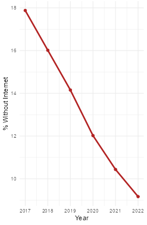
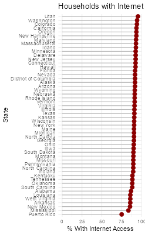

## Research Question

**How does internet access vary across the United States, and which regions, despite high incomes or urban settings, still experience significant digital exclusion?**

---

## Why Internet Access Matters

Yes, in a world where the absence of internet can ground airlines, freeze Wall Street, or halt emergency services — digital access is not just a convenience, it's a necessity.

Across the globe and right here in the U.S., there have been real moments where the internet’s absence caused chaos, economic loss, and even put lives at risk:

### Major Incidents Where Lack of Internet Caused Harm

1. **Hurricane Maria – Puerto Rico (2017)**
   - The hurricane wiped out power and internet across the island.
   - Residents couldn't call for help, check weather updates, or contact family.
   - Rural areas remained disconnected for **months**, delaying aid and recovery.

2. **Comcast/Xfinity Outage – United States (Nov 2021)**
   - A major ISP went down across multiple states.
   - Millions lost access during work-from-home and virtual school hours.
   - Remote workers, students, and telehealth services were all impacted.

3. **Ukraine-Russia War (2022–Present)**
   - Cyber and physical attacks damaged internet infrastructure in Ukraine.
   - Emergency internet (via *SpaceX Starlink*) had to be deployed to restore connections.

---

## About the Data: ACS 5-Year Estimates

This analysis uses data from the **American Community Survey (ACS) 5-Year Estimates (2018–2022)**.

Why 5-Year ACS?

- Provides the **most reliable** and stable estimates, especially for small geographies like census tracts and rural counties.
- Covers **broad population segments** over multiple years — helpful in identifying trends.
- Offers **uniform national coverage** useful for consistent comparison across states and counties.

> [Why the Census asks about internet access](https://www.census.gov/acs/www/about/why-we-ask-each-question/computer/)

### What Does the Census Ask?

Below are screenshots of the actual ACS survey questions that ask about computer and internet use. These responses form the basis for the data used in this analysis.

  
  
  

> *Images above sourced from [Census.gov](https://www.census.gov).*

**Note:** Broadband, cellular data plans, satellite internet, and other services are grouped together in ACS responses — the survey does not distinguish between speed, type, or quality of access.

---

## Explore the Map

{target="_blank"}

This map allows users to zoom into any U.S. state and view the percentage of households without internet at both **state** and **county** levels.

 
  [ Need Help Using the Map?](imgs/help.html){target="blank"}
 
---

### Key Mapping Insights

- States in the **South and West** consistently show higher rates of digital exclusion.
- **Mississippi** has the **highest** rate of disconnected households (~21.6%).
- **Utah** has the **lowest** (~6.4%).
- Among counties, **Holmes County, MS** tops the list, while **Douglas County, CO** shows near-universal access.

---

## Data Visualization

### Internet Access Over Time (2017–2022)

This chart shows how the average percentage of households **without internet access** has changed over time across all 50 U.S. states.

{.lightbox}

---

### State-by-State Internet Gaps (2022)

This chart compares states based on their most recent ACS data — labeling each state’s share of households with **no internet access**.

{.lightbox}

---

## Data Analysis

### Surprising Patterns in High-Income Regions

{.lightbox}

> Even in some of the wealthiest, most tech-savvy regions in America — from Silicon Valley to downtown Manhattan — a surprising portion of households still lack internet access.
>
> This isn’t just a rural issue. In places like the **Bronx** and **Brooklyn**, nearly **1 in 5 households** remain offline. Meanwhile, **San Francisco** and **San Jose**, hubs of global tech, show digital exclusion rates above **9%**.
>
> These gaps may be linked to:
>
> - **Language barriers**
> - **Elderly populations**
> - **Housing instability**
> - **Privacy or security concerns**

---

### Plausible Reasons Behind Digital Exclusion

- Affordability and data plan costs
- Lack of devices (computers, routers)
- Elderly residents or digitally averse populations
- Language barriers in immigrant-heavy areas
- Distrust in data security or government programs
- Housing instability or shared living situations

---

## Conclusion

This analysis highlights that **digital exclusion is a complex, persistent issue**, affecting both rural and urban areas — even in tech-rich or high-income regions.

- While internet access has improved over time, **gaps remain deep and uneven**.
- Mapping reveals **regional clusters** of disconnected communities often masked in national averages.
- Policy efforts need to go beyond laying fiber — tackling affordability, education, and awareness.

---

## Limitations

- ACS data provides estimates, not exact counts.
- Internet access data doesn't distinguish **mobile vs broadband vs satellite**.
- Some small counties or tracts had **suppressed or missing values**.
- The map uses static snapshots — it cannot capture **temporal dynamics** or **speed/quality** of access.

---

## Further Questions

- How does internet access affect **educational outcomes** or **employment rates**?
- What are the **barriers to adoption** in areas that technically have internet infrastructure?
- Could programs like **[ACP (Affordable Connectivity Program)](https://www.fcc.gov/acp)** narrow this gap?
- What are the experiences of **Native American reservations**, often overlooked in national datasets?

---

